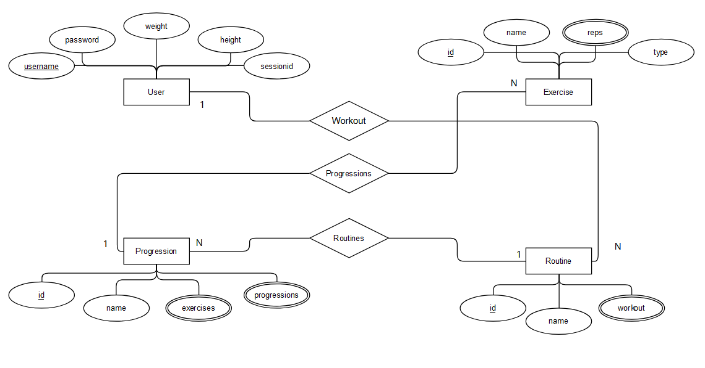
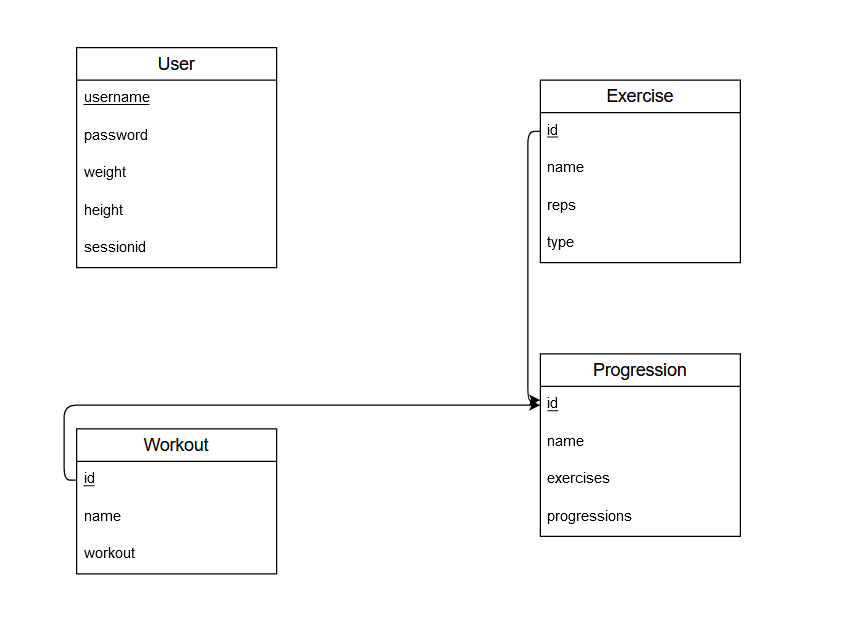

# Project Report

## Conceptual design

The design of my project is based on a mobile app architechture.
There is a server that handles all communication with the PostgreSQL database.
The client communicates with the server locally using a public http api.
The client includes an embedded database that stores data retrieved from the server.

## ER Diagram

## Normalization

The user table is in 2nd normal form
All rows are unique and each cell contains a single value and all
values are non divisible and all attributes depend on the candidate key.
To transform it into 3rd normal form the sessionid would need to
be moved to a different table since it can be used in place of the username.

The exercise table is not in normal form since it contains a list. This table could be transformed into 3nf
if the list was split up into 2 seperate values.

The progression table is not in normal form since it contains 2 lists.
To place this table in a normal from these would have to be moved to a seperate relation.

The routine table is not in normal form since it contains a json field. To place this table in normal form
the 'workout' field would need to be moved into a seperate relation.

## Database Schema

## Implementaation

My implementation is web based with a client and server model.
The server provides an api accessed by the client.
The client has an embedded database that caches the data retrieved from the server.
This is done as the application is supposed to represent a mobile application.
The user can update values stored on the server such as weight and height.

## Bonus features

- Timer system (for rest and time based exercies)
- Local workout history
- Interchangable exercices
- Local database
